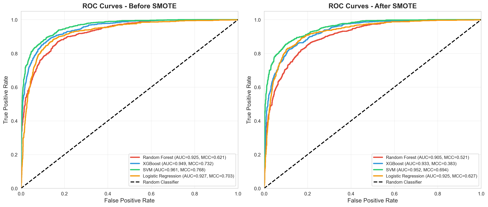
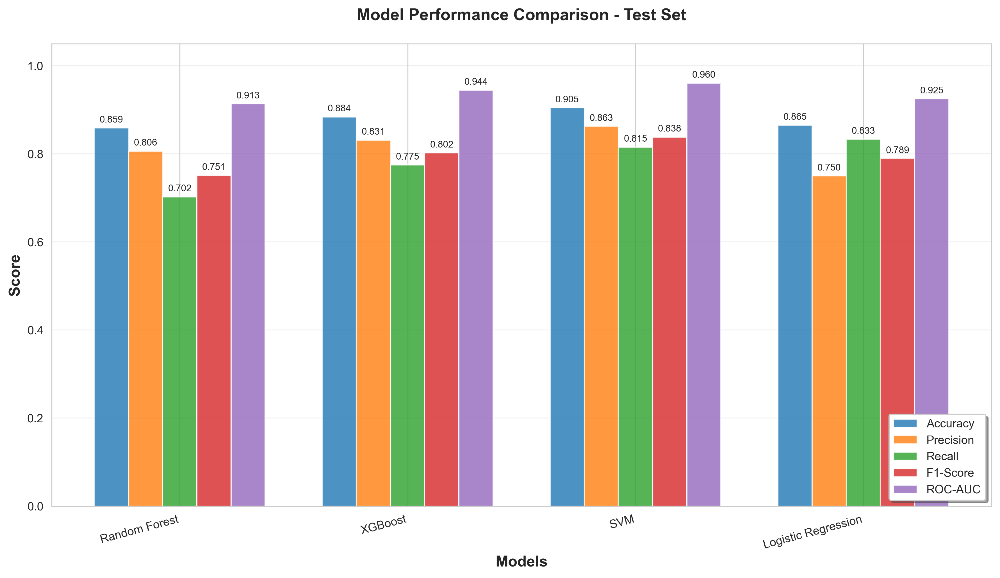
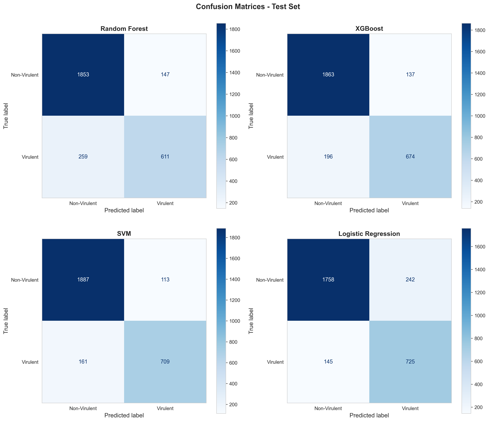

# 🧬 Virulence Protein Predictor

### A Computational Pipeline for Sequence-Based Virulence Classification

---

## Highlights

* 500+ sequence-derived protein features (AAC, DPC, **PseAAC**)
* Multi-model ML framework (Random Forest, XGBoost, SVM, Logistic Regression)
* Advanced validation (**Cross-validation, MCC, Y-randomization, Domain Applicability**)
* Ensemble prediction using majority voting
* Fully reproducible end-to-end pipeline

---

## Abstract

Accurate identification of virulent proteins is critical for understanding pathogenic mechanisms and enabling therapeutic target discovery.

This project presents a **machine learning-based computational framework** that classifies proteins as *virulent* or *non-virulent* using sequence-derived features.

A comprehensive feature set (>500 features) was engineered from protein sequences, followed by training and evaluation of multiple machine learning models. The pipeline demonstrates robust predictive performance and provides an extensible framework for bioinformatics-driven pathogen analysis.

---

## 📊 Results

### 🔹 ROC Curve (Main Result)



### 🔹 Model Comparison



### 🔹 Confusion Matrix



---

## Objectives

* Develop a **feature-rich representation** of protein sequences
* Build and compare multiple ML models for virulence prediction
* Evaluate performance using robust statistical metrics
* Enable prediction on unseen protein sequences
* Provide a **fully reproducible pipeline**

---

## Methodology

### 1. Feature Engineering

Protein sequences were transformed into numerical representations using:

* Amino Acid Composition (AAC)
* Dipeptide Composition (DPC)
* **Pseudo Amino Acid Composition (PseAAC)**
* Physicochemical properties (molecular weight, GRAVY, instability index)
* Charge & polarity-based features
* Signal peptide and structural heuristics

➡️ **Total features: 500+ per sequence**

---

### 2. Data Preprocessing

* Train–Validation–Test split
* Feature scaling (standardization)
* Class imbalance handling using **SMOTE**

---

### 3. Model Development

* Random Forest
* XGBoost
* Support Vector Machine (RBF kernel)
* Logistic Regression

---

### 4. Evaluation Strategy

Models were evaluated using:

* Accuracy, Precision, Recall, F1-score
* ROC-AUC and **Matthews Correlation Coefficient (MCC)**
* ROC and Precision-Recall curves
* Confusion matrices

Advanced validation:

* Cross-validation (5-fold / 10-fold)
* **Y-randomization testing (model robustness check)**
* **Domain Applicability Analysis (prediction reliability assessment)**

---

### 5. Prediction Framework

The prediction module enables classification of new protein sequences:

* **Input**: FASTA file
* **Output**:

  * Class label (Virulent / Non-virulent)
  * Probability score
  * Ensemble prediction

➡️ Ensemble decision rule:
Prediction is based on **majority voting**, where the final class is assigned if ≥ half of the models agree.

---

## Dataset

The dataset used in this study was obtained from publicly available sources (e.g., UniProt / literature).

⚠️ Raw and processed datasets are not included due to size constraints.
They are automatically generated when running the pipeline.

---

## 📁 Project Structure

```bash id="uxc4lx"
virulence-protein-prediction/
│
├── README.md
├── requirements.txt
├── .gitignore
│
├── data/
│   ├── raw/
│   └── processed/
│
├── src/
│   ├── feature_extraction.py
│   ├── preprocess.py
│   ├── train_models.py
│   ├── evaluate_models.py
│   ├── predict.py
│   ├── feature_extractor.py
│   ├── validate_models.py
│   └── validate_models_enhanced.py
│
├── pipeline/
│   └── master_pipeline.py
│
├── models/
│
├── results/
│   ├── figures/
│   └── validation/
│
└── examples/
    └── sample.fasta
```

---

## Reproducibility

### Installation

```bash id="mrg5rb"
git clone https://github.com/your-username/virulence-protein-prediction.git
cd virulence-protein-prediction
pip install -r requirements.txt
```

---

### Run Full Pipeline

```bash id="90rf7u"
python pipeline/master_pipeline.py
```

---

### Predict on New Sequences

```bash id="y3x0ik"
python src/predict.py --input examples/sample.fasta
```

---

## 📈 Results Summary

* Multi-model evaluation demonstrated strong classification performance
* Ensemble predictions improved robustness and stability
* Advanced validation confirmed model reliability
* Domain applicability analysis ensures trustworthy predictions

---

## Scientific Significance

* Enables **high-throughput virulence prediction**
* Supports **drug target identification and pathogen analysis**
* Demonstrates effectiveness of **sequence-based ML approaches**
* Provides a scalable and extensible bioinformatics framework

---

## Limitations

* Relies solely on sequence-derived features
* No structural or experimental validation included
* Performance depends on dataset quality and balance

---

## Future Work

* Integration of structural features (AlphaFold / PDB)
* Deep learning models (CNN, RNN, Transformers)
* External validation on independent datasets
* Web server or API deployment

---

## Author

**Vanathi Shanmugam**
Bioinformatics | Genomics | Machine Learning

🔗 LinkedIn: https://www.linkedin.com/in/vanathi-shanmugam-26127928a

---

## License

This project is intended for academic and research purposes.

---

## Acknowledgments

Built using:
- NCBI, UniProt and PHI-base for source datas
- scikit-learn for ML algorithms
- BioPython for sequence analysis
- XGBoost for gradient boosting
- imbalanced-learn for SMOTE
- matplotlib/seaborn for visualizations

---
